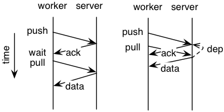

# Tutorial of the Parameter Server

Here we show several examples on how to use the simplified parameter server API [ps.h](../include/ps.h).

## Worker APIs

### Simple `Push` and `Pull`
On the first [example](example_a.cc), we define worker nodes and server nodes by
`CreateServerNode` and `WorkerNodeMain`, respectively. Next ask workers to
push a list of key-value pairs into servers and then pull the new values back.

```c++
#include "ps.h"
typedef float Val;

int CreateServerNode(int argc, char *argv[]) {
  ps::KVServer<Val> server; server.Run();
  return 0;
}

int WorkerNodeMain(int argc, char *argv[]) {
  using namespace ps;
  std::vector<Key> key = {1, 3, 5};
  std::vector<Val> val = {1, 1, 1};
  std::vector<Val> recv_val(3);

  KVWorker<Val> wk;
  int ts = wk.Push(key, val);
  wk.Wait(ts);

  ts = wk.Pull(key, &recv_val);
  wk.Wait(ts);

  std::cout << MyNodeID() << ": " <<
      CBlob<Val>(recv_val).ShortDebugString() << std::endl;
  return 0;
}
```

This example can be compiled by `make -C .. guide` and run using 4 worker nodes
(processes) and 1 server node by `./local.sh 1 4 ./example_a`. A possible
output is
```
values pulled at W3: [3]: 2 2 2
values pulled at W0: [3]: 2 2 2
values pulled at W2: [3]: 4 4 4
values pulled at W1: [3]: 4 4 4
```
Other information is logged in the `log/` directory.


### Time dependency and callback

Note that we called `Wait` after each `Push` and `Pull` to wait these two
asynchronous functions actually finished the data communication. Besides
`Wait` we can move the dependency that "My pulled results should at least have
the data I pushed previously" into servers node by specifying the `deps`
options.



Furthermore, we can execute `std::cout` in a callback function. The following
codes ([example_b](example_b.cc)) are equal to above.


```c++
  KVWorker<Val> wk;
  int ts = wk.Push(key, val);

  SyncOpts opts;
  opts.deps = {ts};
  opts.callback = [&recv_val]() {
    std::cout << "values pulled at " << MyNodeID() << ": " <<
    CBlob<Val>(recv_val).ShortDebugString() << std::endl;
  };
  ts = wk.Pull(key, &recv_val, opts);
  wk.Wait(ts);
```

### Zero-copy communication

In default, both `Push` and `Pull` will first copy the data so that the user
program can write or delete data immediately. In some situation, the memcpy
overhead is expensive, we can then use `ZPush` and `ZPull` to do zero-copy data
communication ([example_c](example_c.cc)):

```c++
  SBlob<Key> key = {1, 3, 5};
  SBlob<Val> val = {1, 1, 1};
  SBlob<Val> recv_val(3);

  KVWorker<Val> wk;
  int ts = wk.ZPush(key, val);
  wk.Wait(ts);

  ts = wk.ZPull(key, &recv_val);
  wk.Wait(ts);

  std::cout << "values pulled at " << MyNodeID() << ": " <<
      recv_val.ShortDebugString() << std::endl;
  return 0;
```

Here `SBlob` wrappers a `std::shared_ptr`, the referred memory will be deleted
only if the reference count goes to 0. Therefore, it's safe to delete both `key`
and `val` immediately after `Push`. However, writing them could change the data
sent by this node.

### Filters

We can apply filters to reduce the data communication volume. In the following
example ([example_d](example_d.cc)), we first let both worker and server cache
the keys list to avoid sending the same key list twice, and then apply lossness
compression on values.

```c++
  int n = 1000000;
  SBlob<Key> key(n);
  SBlob<Val> val(n, 1);
  SBlob<Val> recv_val(n, 0);
  for (int i = 0; i < n; ++i) key[i] = kMaxKey / n * i;

  KVWorker<Val> wk;
  int m = 100;
  for (int i = 0; i < m; ++i) {
    SyncOpts opts;
    opts.AddFilter(Filter::KEY_CACHING);
    opts.AddFilter(Filter::COMPRESSING);
    int ts = wk.ZPush(key, val, opts);
    wk.Wait(ts);

    ts = wk.ZPull(key, &recv_val, opts);
    wk.Wait(ts);
  }
  return 0;
```

Using 4 workers and 4 servers (`./local.sh 4 4 ./example_d -logtostderr`), these
two filters can reduce the total number of data sent by a worker from 2GB to 20MB.

## Server APIs

### Simple handle summing the data
TODO

### Adaptive gradient descent
TODO
